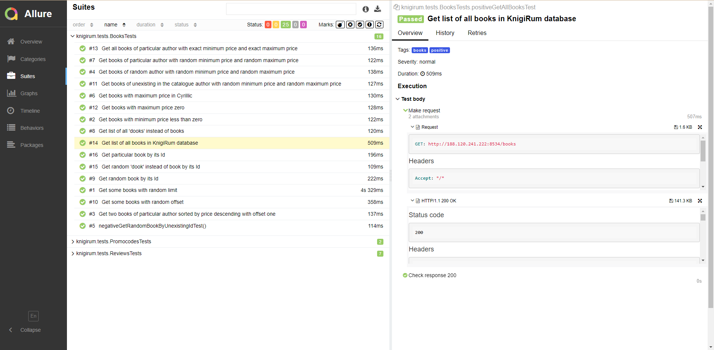

# Демо-проект по автоматизации тестирования API для <p align="center"> [](http://188.120.241.222) </p>

> [КнигиРум](http://188.120.241.222) - тренировочный сайт, предназначенный для отработки навыков тестирования.

____

> ## :ballot_box_with_check: <a name="Содержание">**Содержание:**</a>

* <a href="#tools">Технологии и инструменты</a>

* <a href="#cases">Примеры автоматизированных тест-кейсов</a>

* <a href="#jenkins">Сборка в Jenkins</a>

* <a href="#console">Запуск тестов из терминала</a>

* <a href="#allure">Allure отчет</a>

* <a href="#telegram">Уведомление в Telegram с помощью бота</a>

____

<a id="tools"></a>
> ## :ballot_box_with_check: <a name="Технологии и инструменты">**Технологии и инструменты:**</a>

<p  align="center"

<code><a href="https://www.java.com/"></a></code>
<code><a href="https://www.jetbrains.com/idea/"></a></code>
<code><a href="https://gradle.org/"></code></a>
<code><a href="https://junit.org/junit5/"></a></code>
<code><a href="https://rest-assured.io/"></a></code>
<code><a href="https://github.com/"></a></code>
<code><a href="https://github.com/allure-framework"></a></code>
<code><a href="https://www.jenkins.io"></a></code>
<code><a href="https://web.telegram.org"></a></code>

</p>

- В данном проекте автотесты написаны на <code>Java</code> с использованием
  фреймворков [REST Assured](https://rest-assured.io/) и [JUnit 5](https://junit.org/junit5/).
- Для сборки проекта был использован [Gradle](https://gradle.org/).
- Удаленный запуск реализован в [Jenkins](https://jenkins.autotests.cloud/) с формированием <code>Allure</code>-отчета.
- Подключена отправка уведомлений о результатах запуска сборки в <code>Telegram</code> при помощи бота.

____

<a id="cases"></a>
> ## :ballot_box_with_check: <a name="Примеры автоматизированных тест-кейсов">Примеры автоматизированных тест-кейсов:</a>

- Просмотр списка всех книг в магазине;
- Просмотр книги по запросу ее Id;
- Поиск книг по различным параметрам: как по отдельности, так и несколько параметров вместе;
- Проверка невозможности нахождения книг по запросам с неправильным синтаксисом;
- Получение скидки в процентах по имеющимся промокодам;
- Проверка невозможности получить скидку при введении несуществующих промокодов;
- Просмотр отзывов читателей по Id книги или Id отзыва;
- Добавление, изменение, удаление отзыва;
- Проверка невозможности посмотреть и добавить отзыв к книге с несуществующим Id.
  
  ____

<a id="jenkins"></a>
> ##  Сборка в [Jenkins](https://jenkins.autotests.cloud/job/knigirum_api)

Для запуска сборки необходимо перейти в раздел <code>Build with Parameters</code> и нажать кнопку <code>Build</code>.

<p align="center">

</p>

После выполнения сборки в блоке <code>Build History</code> напротив номера сборки появляется значок <code>Allure Report</code>, 
при клике на который открывается страница со сформированным html-отчетом.
____

<a id="console"></a>
> ## :ballot_box_with_check: <a name="Запуск тестов из терминала">**Запуск тестов из терминала:**</a>

### Команда для терминала IDE для локального запуска тестов:

```
gradle clean test
```

____

<a id="allure"></a>
> ## </a> <a name="Allure"></a>Allure [Report](https://jenkins.autotests.cloud/job/knigirum_api/7/allure)</a>

### Основная страница отчёта

<p align="center">  
  
</p>  

### Тест-кейсы

<p align="center">  
  


</p>

____

<a id="telegram"></a>

##  Уведомления в Telegram с помощью бота

После завершения сборки созданный в <code>Telegram</code> бот автоматически обрабатывает результаты и отправляет
уведомление со ссылкой на отчет.

<p align="center">

</p>

____
